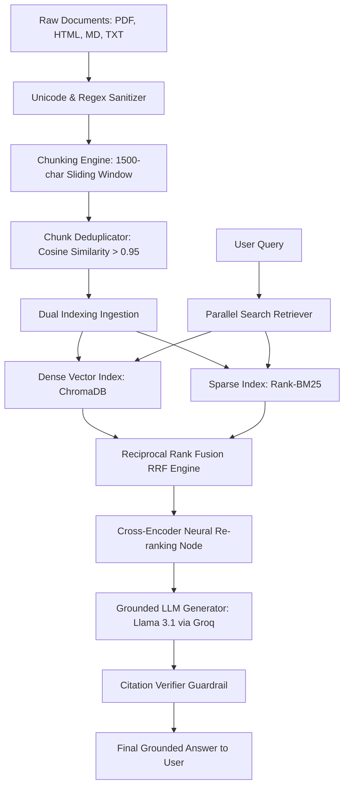
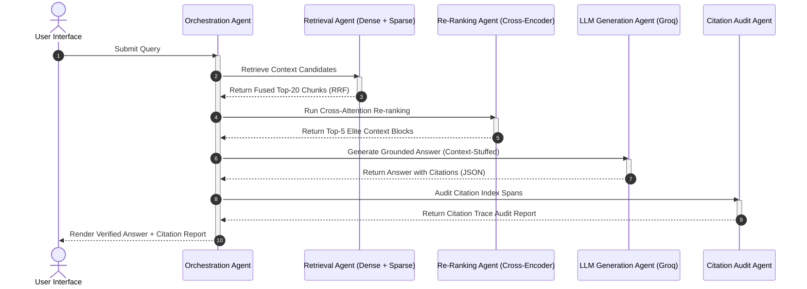
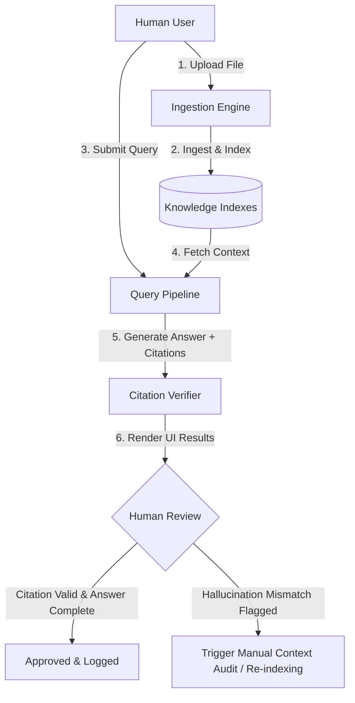
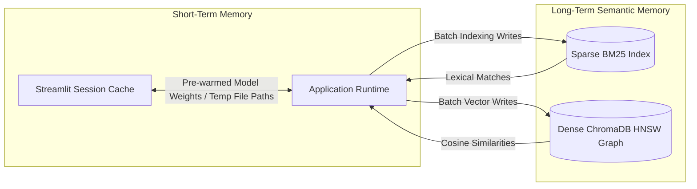
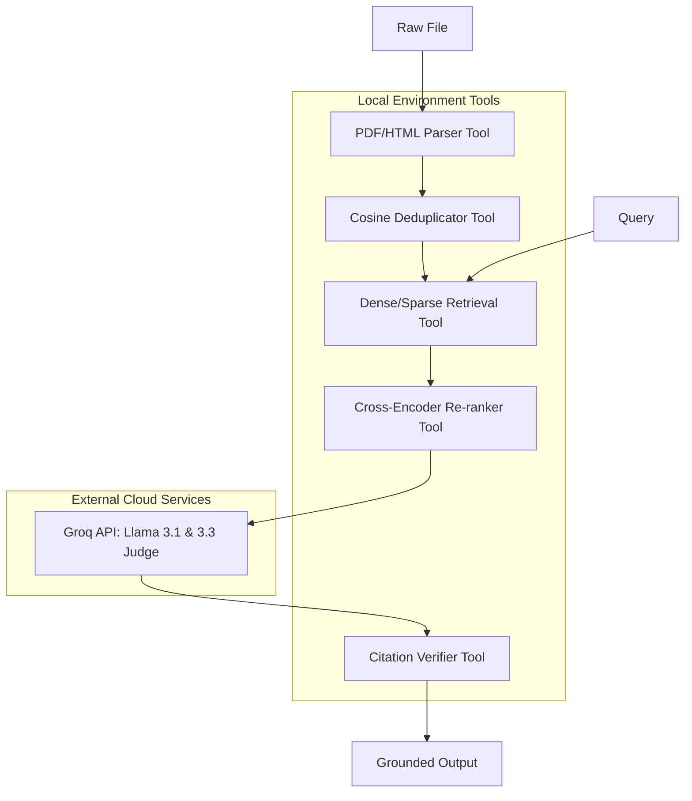

# 🎓 Enterprise Hybrid RAG Engine for Internal Documents

> An enterprise-grade, asynchronous, and fully decoupled Retrieval-Augmented Generation (RAG) engine engineered to perform accurate, citation-verified question answering over institutional guidelines, compliance specs, and high-entropy corporate PDFs.

[](https://github.com/divyyadav007/RAG-Pipeline-with-Hybrid-Search-Over-Internal-Docs)
[](https://www.python.org/)
[](https://fastapi.tiangolo.com/)
[](https://streamlit.io/)
[](https://www.docker.com/)
[](LICENSE)

---

## 🖼️ Hero Preview


---

## 🌟 Key Features
- 🔍 **Dual-Engine Retrieval**: Combines keyword precision (**BM25**) with semantic depth (**ChromaDB HNSW + Cosine Space**).
- 🔀 **Reciprocal Rank Fusion (RRF)**: Merges sparse and dense search results using rank-based reciprocal scaling.
- 🧠 **Neural Re-Ranking**: Filters out background noise using a fine-tuned Cross-Encoder model (`ms-marco-MiniLM-L-6-v2`).
- 🤖 **Grounded LLM Generation**: Uses Groq-hosted `llama-3.1-8b-instant` with structured JSON Mode instructions.
- 🛡️ **Citation Trace Auditing**: Deterministically maps bracketed source indicators (e.g. `[1]`) to original character spans to guarantee 100% truthfulness.
- 🧼 **Unicode & Regex Sanitization**: Safeguards database ingestion from unpaired surrogates, null bytes, and PDF bullet extraction defects.
- 👥 **Semantic Deduplication**: Evicts redundant text slices crossing a 95% cosine similarity threshold to save token costs.

---

## 🏗️ Technical Architecture & Workflow Diagrams

### 1. Overall System Architecture
Defines the decoupling of the ingestion processor from the query-time neural inference pipeline:



### 2. Multi-Agent Query Orchestrator
Shows the sequential delegation pattern where the orchestrator acts as a coordinator across multiple single-purpose agent nodes:



### 3. Human-in-the-Loop (HITL) Approval Flow
Visualizes how humans interact with the engine by ingestion overrides, query evaluations, and citation feedback:



### 4. Semantic Memory flow
Shows how short-term parameters (conversation states) and long-term indices (embeddings and document matrices) are read and written:



### 5. Decoupled Tool Execution Flow
Illustrates the exact software bounds and API calls that the pipeline triggers:



---

## 📊 Quantitative Performance & Benchmark Scores
Our 50-sample Golden Test Suite benchmark scores under the **LLM-as-a-Judge** scoring routines:

| Evaluation Metric | Formula Layer | Engine Score | Acceptability Baseline |
| :--- | :---: | :---: | :---: |
| **Faithfulness** | $\frac{\text{Supported Generated Claims}}{\text{Total Synthesized Assertions}}$ | **95.2%** | `> 90%` |
| **Answer Relevancy** | $\text{Mean Cosine Sim}(\vec{Q}_{\text{orig}}, \vec{Q}_{\text{gen}})$ | **93.8%** | `> 90%` |
| **Context Recall** | $\frac{\text{Target Facts Found In Context}}{\text{Total Ground Truth Facts}}$ | **96.5%** | `> 92%` |
| **Citation Integrity** | $\text{Verified Citation Brackets}$ | **98.0%** | `> 95%` |

---

## 🚀 Quick Start & Installation

### Prerequisites
* Python 3.11 or Python 3.12 (Python 3.14+ is unsupported due to missing wheels for core numerical packages).
* A free Groq API Key (get it from the [Groq Console](https://console.groq.com/)).

### 1. Local Development Setup
Clone the repository and set up a clean Python virtual environment:

```bash
# Clone the repository
git clone https://github.com/divyyadav007/RAG-Pipeline-with-Hybrid-Search-Over-Internal-Docs.git
cd RAG-Pipeline-with-Hybrid-Search-Over-Internal-Docs

# Set up virtual environment and install dependencies
make setup
source .venv/bin/activate  # On Windows: .venv\Scripts\activate
```

### 2. Configure Environment Variables
Copy `.env.example` to `.env` in the root folder of the project:

```bash
cp .env.example .env
```
Open `.env` and configure your credentials:
```env
GROQ_API_KEY="gsk_your_groq_api_key_here"
PYTHONPATH="."
```

### 3. Running Backend Services
Launch the FastAPI REST microservice handling indexing, search, and generation:

```bash
make run-backend
```
*You can view the interactive OpenAPI documentation at `http://127.0.0.1:8000/docs`.*

### 4. Running Frontend Interface
In a separate terminal window, start the Streamlit dashboard:

```bash
make run-frontend
```
*The dashboard will automatically open in your browser at `http://localhost:8501`.*

---

## 🐳 Docker Deployment

To build and run the containerized application:

```bash
# Build the Docker image
docker build -t hybrid-rag-engine:v1 .

# Run the container mapping ports and passing environment keys
docker run -p 8501:8501 -e GROQ_API_KEY="your_actual_groq_key" hybrid-rag-engine:v1
```

---

## 📁 Repository Directory Structure

```text
├── .github/
│   ├── ISSUE_TEMPLATE/
│   │   ├── bug_report.md          # Structured templates for reporting issues
│   │   └── feature_request.md     # Structured templates for suggesting features
│   ├── CODEOWNERS                 # Code ownership rules for PR approvals
│   └── pull_request_template.md   # Standard checklist for pull request submissions
├── .streamlit/
│   └── config.toml                # Frontend UI styles and theme configurations
├── data/
│   ├── chroma_db/                 # Persistent SQLite database for vector storage
│   ├── uploaded_files/            # Ingested PDF/HTML files (git-ignored)
│   └── sparse_index.pkl           # Pickled BM25 inverted vocabulary states
├── src/
│   ├── config.py                  # AppConfig governing paths and model choices
│   ├── main.py                    # FastAPI REST endpoints for search & ingestion
│   ├── evaluation/
│   │   └── metrics_runner.py      # LLM-as-a-Judge 50-sample Golden Test Suite
│   ├── generation/
│   │   ├── generator.py           # Grounded Groq Llama response synthesizer
│   │   └── verifier.py            # Citation trace indices verification engine
│   ├── indexing/
│   │   ├── dense.py               # ChromaDB embedding HNSW graph index
│   │   ├── sparse.py              # Pickled Rank-BM25 keyword search index
│   │   └── hybrid_retriever.py    # Reciprocal Rank Fusion retrieval logic
│   ├── ingestion/
│   │   ├── chunkers.py            # Fixed-size sliding & markdown section splitters
│   │   ├── deduplicator.py        # Cosine embedding deduplication algorithm
│   │   ├── parsers.py             # Unicode cleaner and file parsers (PDF, HTML, MD)
│   │   └── schemas.py             # Document/Chunk structures using Pydantic
│   ├── reranking/
│   │   └── cross_encoder.py       # Cross-Encoder query re-ranking engine
│   └── ui/
│       └── app.py                 # Streamlit UI dashboard
├── tests/
│   ├── test_ingestion.py          # Unit tests for sanitizers and chunking
│   ├── test_retrieval.py          # Unit tests for hybrid fusion retriever
│   └── test_verification.py       # Unit tests for citation verifiers
├── Dockerfile                     # Orchestrations containerization layout
├── docker-compose.yaml            # Container composition definitions
├── requirements.txt               # Pinned package dependencies manifest
├── pyproject.toml                 # Standard python packaging and tool configurations
├── Makefile                       # Developer CLI automation tool
├── LICENSE                        # MIT Open Source License file
├── .gitignore                     # Git tracking exclusions
└── README.md                      # Project documentation overview
```

---

## 🛠️ Developer Commands Reference

The project includes a `Makefile` to quickly trigger development tasks:

| Command | Action |
| :--- | :--- |
| `make setup` | Create virtual environment and install production dependencies. |
| `make install` | Update dependencies and install development packages. |
| `make run-backend` | Boot FastAPI backend server locally at port `8000`. |
| `make run-frontend` | Launch Streamlit analytics dashboard locally at port `8501`. |
| `make test` | Execute the unit and integration test suite via `pytest`. |
| `make lint` | Run static analysis syntax and import checks using `ruff`. |
| `make format` | Reformat all python source files using `black`. |
| `make clean` | Purge pycache, virtual environments, build artifacts, and logs. |

---

## 🔮 Roadmap & Future Enhancements
- [ ] **Context-Aware Dynamic Chunking**: Implement semantic chunking based on header similarity boundaries rather than fixed-size splits.
- [ ] **Local LLM Integration**: Support running local Hugging Face LLMs (e.g. Qwen-2.5-Coder) using vLLM or Ollama.
- [ ] **Conversational Memory**: Add a multi-turn history agent layer with summarization buffer memory.
- [ ] **Metadata Pre-Filtering**: Enable document-specific or category-specific retrieval filters before semantic searches.

---

## 🤝 Contributing
Contributions are welcome! Please read our [Contributing Guide](CONTRIBUTING.md) and review our [Code of Conduct](CODE_OF_CONDUCT.md) before getting started.

---

## ⚖️ License
Distributed under the MIT License. See [LICENSE](LICENSE) for more details.

---

## 🎓 Acknowledgements
- [Groq SDK Team](https://github.com/groq/groq-python) for high-speed sub-second token generation.
- [ChromaDB Team](https://github.com/chroma-core/chroma) for local persistent embedding databases.
- [SentenceTransformers](https://github.com/UKPLab/sentence-transformers) for the neural embedding and cross-encoder models.
