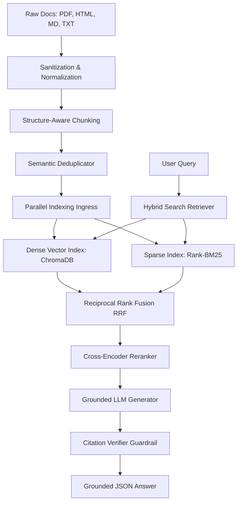
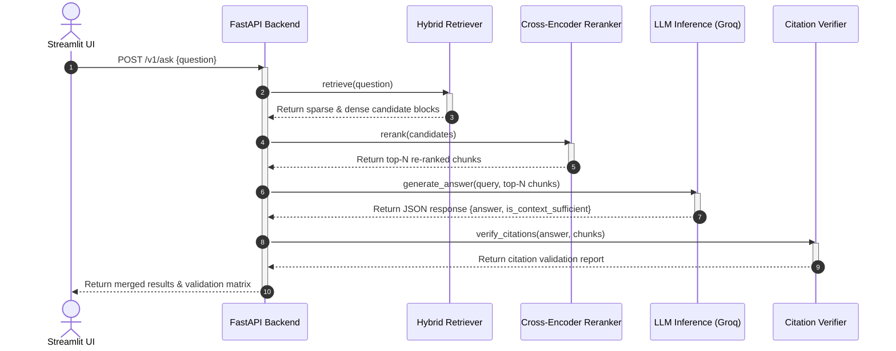
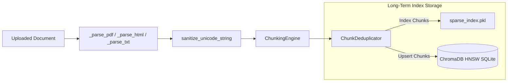
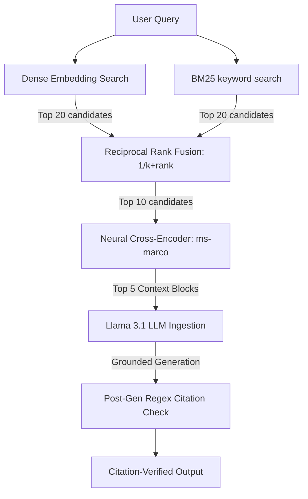

# Enterprise Hybrid RAG Engine for Internal Documents

An enterprise-grade, asynchronous, and fully decoupled Retrieval-Augmented Generation (RAG) engine engineered to perform accurate, citation-verified question answering over complex institutional compliance specifications and corporate PDF/HTML/Markdown files.

[](https://www.python.org/)
[](https://fastapi.tiangolo.com/)
[](https://streamlit.io/)
[](https://www.docker.com/)
[](LICENSE)

---

## Short Project Summary
This project implements a complete RAG pipeline featuring double-engine retrieval (lexical BM25 and semantic vector search) combined using Reciprocal Rank Fusion (RRF) and re-ranked using a neural Cross-Encoder model. The system operates either as a standalone local desktop pipeline or as a decoupled production-ready microservice architecture. A deterministic citation verification guardrail matches LLM-generated assertions directly back to character spans in document chunks to prevent hallucination drift.

---

## Project Preview

*Streamlit Dashboard featuring Query Interfaces, Citation Verifiers, and the Asset Ingestion panel.*

---

## Key Features
* **Dual-Index Search Ingress**: Merges exact keyword matching (**BM25Okapi**) with neural similarity search (**ChromaDB HNSW graph**).
* **Reciprocal Rank Fusion (RRF)**: Fuses sparse and dense candidate lists using rank-based reciprocal scaling parameters.
* **Neural Re-Ranking Pass**: Maximizes context density and filters background noise using a Cross-Encoder (`ms-marco-MiniLM-L-6-v2`).
* **Microservices Integration**: Decoupled design where the UI can offload indexing and query execution to the FastAPI backend service.
* **Citation Trace Auditing**: Deterministically audits bracketed LLM references (e.g. `[1]`) against source index spans to ensure truthfulness.
* **Unicode & Text Normalization**: Prevents database and Pydantic validation crashes by filtering null bytes, surrogates, and PDF bullet extraction gluing errors.
* **Semantic Deduplicator Node**: Employs cosine embeddings to remove redundant incoming chunks (>95% similarity) to minimize LLM token costs.

---

## Architecture Overview

### 1. Overall System Architecture
Shows the decoupled ingestion processor, data storage layouts, and query-time neural inference pipeline:



### 2. Request Flow
Traces the execution sequence of a user question through the microservice boundaries:



### 3. Data Flow
Visualizes how document data is processed and distributed into long-term memory indexes:



### 4. RAG Pipeline
Illustrates the exact math and filtering logic applied at each step of the retrieval-generation loop:



---

## Tech Stack
* **Core RAG Logic**: `SentenceTransformers` (Embeddings & Cross-Encoder), `Rank-BM25` (BM25Okapi)
* **Vector Database**: `ChromaDB` (SQLite/HNSW local backend)
* **LLM Engine**: `Groq SDK` (Llama-3.1-8b-instant inference)
* **Backend Web Framework**: `FastAPI` + `Uvicorn`
* **Frontend Web Framework**: `Streamlit`
* **Orchestration**: `Docker` & `Docker Compose`
* **Testing & Quality**: `Pytest`, `Ruff`

---

## Project Structure
```text
├── .github/
│   └── workflows/
│       ├── lint.yml               # Automated code lint check (Ruff)
│       └── test.yml               # Automated unit tests check (Pytest)
├── .streamlit/
│   └── config.toml                # Custom Streamlit UI parameters
├── sample_data/
│   └── Policy-Document.md         # Reference document matching Golden Test suite
├── src/
│   ├── config.py                  # AppConfig path/parameters management
│   ├── main.py                    # FastAPI entrypoint endpoints routing
│   ├── evaluation/
│   │   └── metrics_runner.py      # LLM-as-a-Judge Golden Test execution suite
│   ├── generation/
│   │   ├── generator.py           # Grounded Llama Answer generator via Groq
│   │   └── verifier.py            # Citation trace verification engine
│   ├── indexing/
│   │   ├── dense.py               # HNSW vector database indexing interface
│   │   ├── sparse.py              # BM25 pickle indexing interface
│   │   └── hybrid_retriever.py    # Reciprocal Rank Fusion execution layer
│   ├── ingestion/
│   │   ├── chunkers.py            # Markdown and sliding window chunkers
│   │   ├── deduplicator.py        # Semantic Cosine deduplicator
│   │   ├── parsers.py             # Unicode sanitizers and file parsers
│   │   └── schemas.py             # Pydantic data schemas definitions
│   ├── reranking/
│   │   └── cross_encoder.py       # Cross-Encoder model relevance reranker
│   └── ui/
│       └── app.py                 # Streamlit UI dashboard
├── tests/
│   ├── test_api.py                # Unit tests for FastAPI endpoint routes
│   ├── test_ingestion.py          # Unit tests for text sanitizers/chunking
│   ├── test_retrieval.py          # Unit tests for rank fusion logic
│   └── test_verification.py       # Unit tests for citation check spans
├── Dockerfile                     # Unified container environment recipe
├── docker-compose.yaml            # Microservices composition manager
├── pyproject.toml                 # Packaging metadata and tool parameters
├── requirements.txt               # Pinned package requirements manifest
├── run.py                         # Streamlit direct launcher script
└── README.md                      # Project documentation manual
```

---

## Installation
Clone the repository and set up a virtual environment:

```bash
git clone https://github.com/suraj-78/RAG-Pipeline-with-Hybrid-Search-Over-Internal-Docs.git
cd RAG-Pipeline-with-Hybrid-Search-Over-Internal-Docs

# Set up virtual environment
python -m venv .venv
source .venv/bin/activate  # On Windows use: .venv\Scripts\activate

# Install required dependencies
pip install -r requirements.txt
```

---

## Running with Docker
Deploy the split microservices architecture (FastAPI Backend + Streamlit Frontend) using Docker Compose:

```bash
# Provide your Groq API key in the shell env, then launch composition
$env:GROQ_API_KEY="your-groq-api-key"   # On Windows PowerShell
export GROQ_API_KEY="your-groq-api-key" # On Linux/macOS

docker compose up --build
```
* Access the FastAPI Swagger endpoints at: `http://localhost:8000/docs`
* Access the Streamlit Web interface at: `http://localhost:8501`

---

## Running Locally

### Option A: Standalone Mode (Single Process)
Run Streamlit directly. The dashboard will load index engines and neural weights in-process:

```bash
python run.py
```

### Option B: Microservices Mode (Decoupled Processes)
Start the FastAPI server and Streamlit in separate terminals:

```bash
# Terminal 1: Launch FastAPI Backend
uvicorn src.main:app --port 8000 --reload

# Terminal 2: Configure UI to point to API and launch
export BACKEND_API_URL="http://localhost:8000" # On Linux/macOS
$env:BACKEND_API_URL="http://localhost:8000"   # On Windows PowerShell
python run.py
```

---

## Environment Variables
* `GROQ_API_KEY`: Required. Your developer access key to Groq Cloud Services.
* `BACKEND_API_URL`: Optional. Address of the running FastAPI server. If provided, the UI functions as a microservices client.

---

## How it Works
1. **Document Ingress**: Documents uploaded via the UI are saved to a shared workspace folder.
2. **Text Normalization**: The raw texts are sanitized to remove null characters, surrogates, and glue punctuation.
3. **Chunk Extraction**: Markdown headers trigger structure-aware segments; other layouts fallback to character sliding windows.
4. **Deduplication**: Chunk embeddings are generated and compared. Duplicate nodes with high cosine scores are discarded.
5. **Double Indexing**: The unique chunks are written concurrently to the ChromaDB vector collections and BM25 search indices.

---

## Pipeline / Workflow
When a user asks a question, the execution follows this lifecycle:
* **Lexical retrieval**: Matches keywords in the query against the BM25 catalog.
* **Vector retrieval**: Encodes the query and searches the Chroma DB HNSW space using Cosine similarity.
* **Rank Fusion (RRF)**: Re-scores candidates by summing reciprocal ranks.
* **Attention Reranking**: The Cross-Encoder calculates exact matching tokens.
* **LLM Grounding**: The LLM receives the prompt with ranked chunks and generates an answer matching the strict JSON format.
* **Citation Verification**: A parser verifies that all bracket citations point to valid source indices containing matching text.

---

## Performance Notes
* **GPU Acceleration**: The neural Cross-Encoder automatically checks for CUDA availability and offloads tensor computations to the GPU if a graphics card is installed.
* **Decoupled Architecture Memory Savings**: Running the Streamlit frontend in Client Mode (pointing to FastAPI) reduces local frontend memory consumption to ~40MB since no model files are loaded in-process.

---

## Future Improvements
- [ ] Support metadata pre-filtering by category prior to hybrid search execution.
- [ ] Implement conversational agent memory to support multi-turn query context retention.
- [ ] Incorporate semantic chunk splits based on embedding similarity shifts.

---

## License
Distributed under the MIT License. See [LICENSE](LICENSE) for more details.

---

